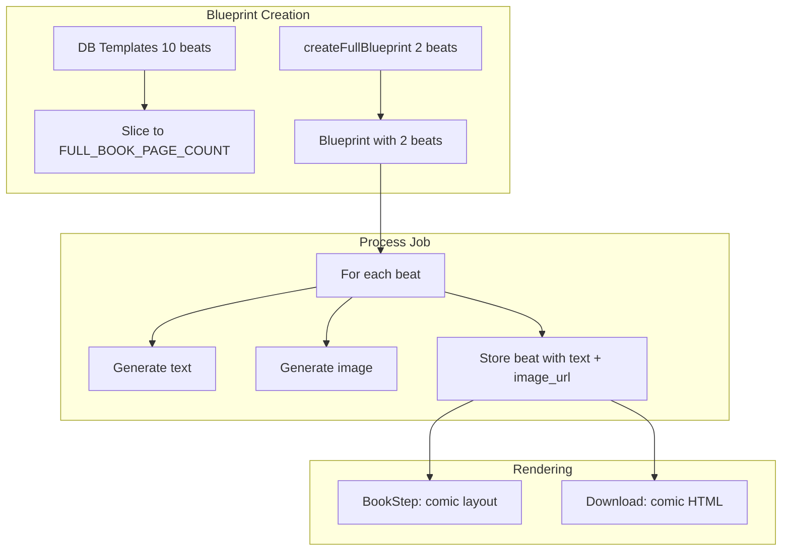

# Comic Layout + 2-Page Book

## Цели

1. **Формат комикса**: текст в виде подписи сверху или снизу картинки (overlay на изображении).
2. **2 страницы вместо 10**: полная книга = 2 beat'а (2 текста + 2 картинки).

## Архитектура

## 1. Константа и конфиг

**Файл:** `app/src/lib/constants.ts`

- Добавить `FULL_BOOK_PAGE_COUNT = 2` (для будущего: можно заменить на `process.env.FULL_BOOK_PAGE_COUNT ?? 2`).
- Экспортировать для использования в blueprint, approve, useCreateFlow.

---

## 2. Blueprint: 2 beat'а

### 2.1 Fallback blueprint (без шаблона)

**Файл:** `app/src/lib/create-flow/blueprint.ts`

- В `createFullBlueprint` заменить `baseBeats` (10 элементов) на 2 beat'а:
  - **Beat 1**: setup + начало (discover, meet) — `narrative_summary` объединяет setup_1 + setup_2 + mission_1.
  - **Beat 2**: challenge + resolution (overcome, return) — объединяет challenge_1–3 + resolution_1–2 + reflection_1.
- Пример структуры:
  - `beat_id: "page_1"`, `page_index: 1`, `narrative_summary`: "Child discovers a magical world and meets a friendly guide who explains the mission"
  - `beat_id: "page_2"`, `page_index: 2`, `narrative_summary`: "Child faces a challenge, overcomes it, completes the mission and returns home with memories"

### 2.2 Template-based blueprint

**Файл:** `app/src/lib/create-flow/blueprint-server.ts`

- Импортировать `FULL_BOOK_PAGE_COUNT` из constants.
- После получения `templateBeats` из matched template: `beats = templateBeats.slice(0, FULL_BOOK_PAGE_COUNT)`.
- Пересчитать `page_index` для каждого beat (1, 2).
- Условие `templateBeats.length >= 10` заменить на `templateBeats.length >= FULL_BOOK_PAGE_COUNT`.

---

## 3. Approve route: динамический total_count

**Файл:** `app/src/app/api/jobs/[id]/approve/route.ts`

- `total_count` в `progress` при создании full job: `fullBlueprint.beats.length` вместо `10`.

---

## 4. useCreateFlow: динамический total_count

**Файл:** `app/src/app/create/hooks/useCreateFlow.ts`

- В `pollForFull`: начальный `total_count` — из `job.progress?.total_count ?? FULL_BOOK_PAGE_COUNT`.
- Использовать `job.progress?.total_count` при наличии, иначе `FULL_BOOK_PAGE_COUNT`.

---

## 5. Comic layout: подпись на изображении

### 5.1 ComicPageLayout

**Файл:** `app/src/app/create/components/ComicPageLayout.tsx`

- Props: `imageUrl`, `caption`, `captionPosition?: "top" | "bottom" | "right" | "left"` (по умолчанию `DEFAULT_CAPTION_POSITION` = `"right"`).
- **Right/left:** текст в колонке на изображении (overlay справа/слева), тёмный полупрозрачный фон, разбиение на абзацы по `\n\n`, `white-space: pre-line` для переносов.
- **Top/bottom:** полоса по краю (как раньше), светлый фон.
- **Пустая подпись:** не рендерить блок подписи.
- **Семантика:** `<figure>` + `<figcaption>`.

### 5.2 BookStep

**Файл:** `app/src/app/create/components/BookStep.tsx`

- Использовать `captionPosition={DEFAULT_CAPTION_POSITION}` (по умолчанию `"right"`).

### 5.3 Download route

**Файл:** `app/src/app/api/orders/[id]/download/route.ts`

- Читать `book.metadata.layout.caption_position`; fallback — `DEFAULT_CAPTION_POSITION`.
- CSS для всех позиций: `.caption-right`, `.caption-left`, `.caption-top`, `.caption-bottom`.
- Разбиение на абзацы, `white-space: pre-line` для right/left.

### 5.4 books.metadata

**Файл:** `app/src/lib/process-job.ts`

- При создании книги записывать `layout: { caption_position: DEFAULT_CAPTION_POSITION }` в `books.metadata`.

---

## 6. Тесты

**Файл:** `app/src/lib/create-flow/__tests__/blueprint.test.ts`

- Обновить тест `"creates blueprint with 10 beats"` → `"creates blueprint with FULL_BOOK_PAGE_COUNT beats"` и проверять `bp.beats.length === 2`.
- Добавить тест для `createFullBlueprint` с проверкой структуры 2 beat'ов.

---

## 7. Комментарии

- `app/src/lib/process-job.ts`: «10 images» → «N images (from blueprint)».
- `app/src/lib/ai/orchestrator.ts`: «Full: 10 beats, 10 images» → «Full: N beats (from blueprint, configurable via FULL_BOOK_PAGE_COUNT)».

---

## 8. Сводка изменений

| Файл | Изменение |
|------|-----------|
| `constants.ts` | `FULL_BOOK_PAGE_COUNT`, `DEFAULT_CAPTION_POSITION = "right"` |
| `blueprint.ts` | `createFullBlueprint` возвращает 2 beat'а |
| `blueprint-server.ts` | Slice template beats до `FULL_BOOK_PAGE_COUNT` |
| `approve/route.ts` | `total_count: fullBlueprint.beats.length` |
| `useCreateFlow.ts` | Динамический `total_count` из job |
| `ComicPageLayout.tsx` | caption top/bottom/right/left, overlay на изображении |
| `BookStep.tsx` | `captionPosition={DEFAULT_CAPTION_POSITION}` |
| `download/route.ts` | CSS для всех позиций, чтение `book.metadata.layout` |
| `process-job.ts` | `layout: { caption_position }` в `books.metadata` |

---

## 9. Порядок реализации

1. constants → blueprint, blueprint-server, approve, useCreateFlow
2. ComicPageLayout → BookStep
3. Остальные правки независимы

## 10. Риски и решения

- **Шаблоны:** slice(0,2) берёт только setup_1 и setup_2 — история обрывается. Решение: оставить slice, при необходимости позже добавить `short_beats` в config шаблонов.
- **Позиция подписи:** `captionPosition` — настраиваемый prop (top/bottom/right/left). По умолчанию `"right"` — текст в колонке на изображении. Хранится в `books.metadata.layout.caption_position`.
