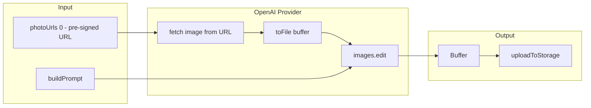

# План: OpenAI images.edit с сохранением лица (input_fidelity)

## Цель

Перевести провайдер OpenAI с `images.generate` (text-only) на `images.edit` (image + prompt) с `input_fidelity: "high"` для сохранения лица ребёнка на иллюстрациях.

## Контекст

| Endpoint | Вход | Сохранение лица |
|----------|------|------------------|
| `images.generate` | Только prompt | Нет |
| `images.edit` | image + prompt, `input_fidelity: "high"` | Да |

Документация: [Generate images with high input fidelity](https://developers.openai.com/cookbook/examples/generate_images_with_high_input_fidelity)

---

## Архитектура



---

## 1. Изменения в providers/openai.ts

### 1.1 Переход с generate на edit

**Текущий код:** `openai.images.generate({ prompt, ... })`

**Новый код:** `openai.images.edit({ image, prompt, input_fidelity: "high", ... })`

### 1.2 Получение image из photoUrls

- `photoUrls[0]` — pre-signed URL (как у Replicate)
- Fetch image: `const res = await fetch(faceUrl); const buffer = Buffer.from(await res.arrayBuffer())`
- Конвертация в Uploadable: `toFile(buffer, "face.png", { type: "image/png" })` — OpenAI SDK экспортирует `toFile`

### 1.3 Параметры images.edit

```ts
await openai.images.edit({
  model: "gpt-image-1.5",
  image: imageFile,           // Uploadable from toFile
  prompt: buildPrompt(input),
  input_fidelity: "high",     // Face preservation
  quality: getQuality(),
  size: "1024x1536",  // Portrait for storybook pages
  output_format: "png",
  n: 1,
});
```

### 1.4 Обработка отсутствия фото

Если `photoUrls` пустой — fallback на `images.generate` (текущее поведение) или возвращать ошибку. По плану: **fallback на generate** — пользователь без фото получит иллюстрацию без лица (как сейчас).

### 1.5 Формат промпта для edit

Промпт для edit описывает **трансформацию** изображения. Текущий `buildPrompt` возвращает что-то вроде "Child in storybook style...". Для edit лучше: "Transform this photo into a children's storybook illustration: [instructions]. Warm, age-appropriate, storybook style."

Добавить префикс в `buildPrompt` при вызове из openai, или передать флаг `mode: "edit"` — чтобы промпт был в формате "Transform...".

**Вариант:** общий `buildPrompt` + в openai провайдере оборачивать: `Transform this photo into ${buildPrompt(input)}` когда есть photoUrls.

---

## 2. Детали реализации

### 2.1 Файл: app/src/lib/ai/providers/openai.ts

```ts
// New flow:
// 1. If photoUrls[0] exists: use images.edit with input_fidelity: "high"
// 2. Else: use images.generate (current behavior, no face)
```

**Ключевые шаги:**
1. Проверить `input.photoUrls[0]`
2. Fetch image, `toFile(buffer, "face.png", { type })`
3. Определить MIME по Content-Type или расширению URL (png/jpeg/webp)
4. Вызвать `images.edit` с `input_fidelity: "high"`
5. Парсить `response.data[0].b64_json` → Buffer
6. При отсутствии фото — вызвать `images.generate` (fallback)

### 2.2 Промпт для edit

Edit ожидает описание трансформации. Пример из cookbook: "Add soft neon purple lighting" или "Generate an avatar of this person in digital art style".

Для storybook:
```
Transform this photo into a children's storybook illustration: [illustration_instructions]. 
Warm, age-appropriate, storybook style. [styleHints]
```

Создать `buildEditPrompt(input)` в `providers/prompt.ts` или добавить опциональный параметр.

### 2.3 Обработка ошибок

- **Fetch фото:** при 4xx/5xx или network error — fallback на placeholder, лог: `"OpenAI edit: failed to fetch reference photo -> placeholder"`
- **Edit API:** при ошибке (rate limit, content policy, etc) — fallback на placeholder, лог: `"OpenAI edit failed"`
- **Логирование:** при успешном edit — `[image-generator] ... provider=openai mode=edit`; при generate — `mode=generate`

### 2.4 Ограничения на входное изображение

- Форматы: PNG, WebP, JPG (< 50MB для GPT image models)
- Определение типа: `Content-Type` из fetch response или расширение URL
- Если размер > 50MB — fallback на placeholder (или будущее: resize перед отправкой)

### 2.5 Стоимость

`input_fidelity: "high"` потребляет больше image input tokens, чем generate. Ориентировочно дороже на 20–50%. Учитывать при биллинге.

### 2.6 Срок действия pre-signed URL

photoUrls — pre-signed URLs с TTL 1 час. Job должен обрабатываться до истечения. Worker polling ~3 сек — обычно ок. При долгой очереди URL может истечь → fetch fail → fallback на placeholder.

---

## 3. Взаимодействие с компонентами

| Компонент | Изменения |
|-----------|-----------|
| **process-job.ts** | Без изменений. Передаёт photoUrls (pre-signed) как сейчас |
| **image-generator.ts** | Без изменений. Вызывает `provider.generate(input)` |
| **providers/types.ts** | Без изменений. ImageGenerationInput уже содержит photoUrls |
| **providers/prompt.ts** | Добавить `buildEditPrompt` или параметр mode |
| **Storage** | Без изменений. Провайдер возвращает buffer + contentType |

---

## 4. Переменные окружения

Без новых переменных. Опционально:

| Переменная | Описание |
|------------|----------|
| `OPENAI_IMAGE_INPUT_FIDELITY` | `high` \| `low` (default: `high` для edit) |

---

## 5. Сравнение: Replicate vs OpenAI edit

| Критерий | Replicate (InstantID) | OpenAI (images.edit) |
|----------|------------------------|------------------------|
| Сохранение лица | Да (InstantID) | Да (input_fidelity) |
| Вход | URL фото + prompt | File + prompt |
| Стоимость | ~$0.038/изобр. | Зависит от quality |
| Специализация | Identity preservation | General image editing |

---

## 6. Чеклист реализации

1. В `providers/openai.ts`: ветка photoUrls → fetch → toFile → images.edit
2. Добавить `buildEditPrompt` в prompt.ts (префикс "Transform this photo into...")
3. Fallback: нет photoUrls → images.generate
4. Fallback: fetch fail → placeholder + лог
5. Fallback: edit API fail → placeholder + лог
6. Определение MIME: Content-Type из fetch или по URL
7. Логирование: mode=edit vs mode=generate
8. Обновить `docs/OPENAI_IMAGE_SETUP.md` — поддержка фото

---

## 7. Будущее расширение

- `OPENAI_IMAGE_MODE`: `edit` | `generate` — принудительный выбор (edit требует фото)
- Поддержка нескольких фото (combine) для edit — по документации OpenAI
- Resize изображения > 50MB перед отправкой
- Выбор «лучшего» фото по face detection (сейчас — photoUrls[0])
- A/B тест Replicate vs OpenAI edit по качеству лица

---

## 8. Решённые уточнения

- **Размер выхода:** 1024x1536 (портрет) — лучше для страницы книги
- **При fetch fail:** fallback на placeholder
