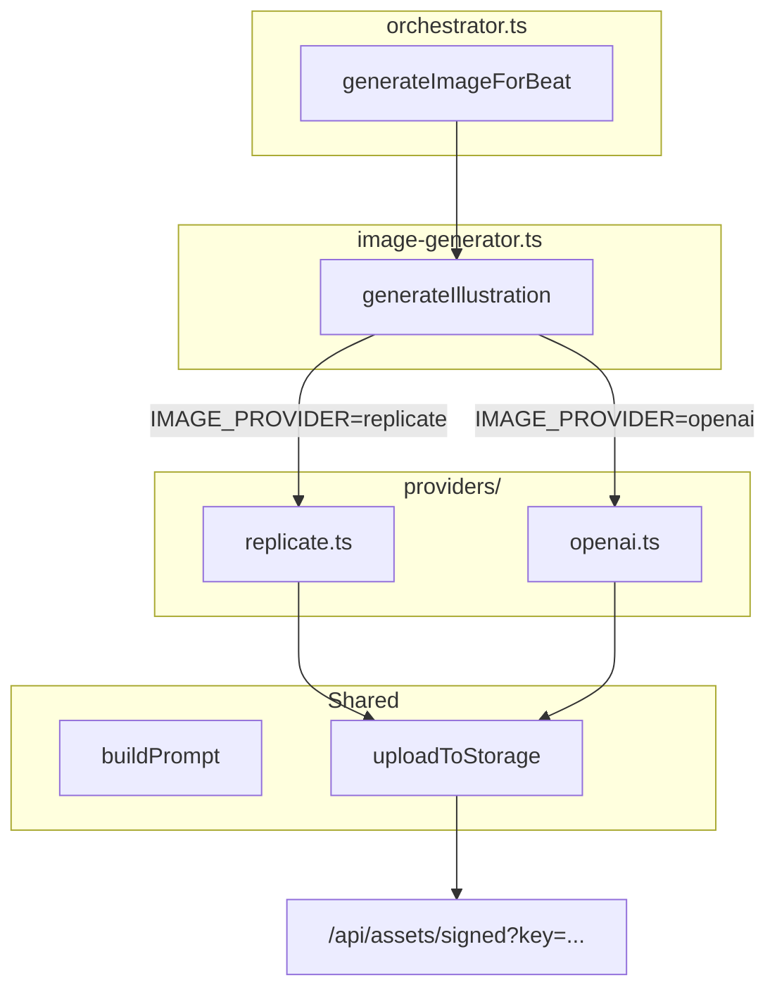

# План: OpenAI как провайдер генерации иллюстраций

## Контекст и ограничения

**Важно:** OpenAI gpt-image-1.5 — text-to-image. **Не поддерживает** входное фото и не сохраняет сходство лица. Иллюстрации будут стилистически качественными, но без персонализации по внешности ребёнка. Replicate InstantID сохраняет лицо, OpenAI — нет. Сравнение идёт по художественному качеству.

**Стоимость:** gpt-image-1.5 — зависит от quality (low/medium/high). Ориентировочно сопоставимо с DALL-E 3.

**Обработка ошибок:** При падении выбранного провайдера (API error, rate limit) — fallback на placeholder, как сейчас с Replicate.

---

## Архитектура (расширяемая)



---

## 1. Структура файлов

```
app/src/lib/ai/
├── image-generator.ts      # Entry point, provider selection, shared upload
├── providers/
│   ├── types.ts           # ImageProvider interface
│   ├── replicate.ts       # Replicate InstantID (existing logic)
│   └── openai.ts          # OpenAI gpt-image-1.5 (new)
```

**Интерфейс провайдера** (`providers/types.ts`):

```ts
export type ImageProviderId = "replicate" | "openai";

export interface ImageProvider {
  id: ImageProviderId;
  generate(input: ImageGenerationInput): Promise<{ buffer: Buffer; contentType: string }>;
}
```

Каждый провайдер возвращает буфер и content-type. Загрузка в storage и формирование proxy URL — в общем коде.

---

## 2. Переменные окружения

| Переменная | Значения | Описание |
|------------|----------|----------|
| `IMAGE_PROVIDER` | `replicate` \| `openai` | Выбор провайдера. По умолчанию: `replicate` при наличии `REPLICATE_API_TOKEN`, иначе `openai` при наличии `OPENAI_API_KEY`, иначе placeholder |

**Поведение:**
- `IMAGE_PROVIDER=openai` → OpenAI (нужен `OPENAI_API_KEY`)
- `IMAGE_PROVIDER=replicate` → Replicate (нужен `REPLICATE_API_TOKEN`)
- Если `IMAGE_PROVIDER` не задан: replicate при наличии `REPLICATE_API_TOKEN`, иначе openai при наличии `OPENAI_API_KEY`, иначе placeholder (обратная совместимость)
- Если токен выбранного провайдера отсутствует → fallback на placeholder

---

## 3. Изменения по файлам

### 3.1 app/src/lib/ai/providers/types.ts (новый)

- `ImageProviderId`, `ImageProvider`
- Экспорт `ImageGenerationInput` и `ImageGenerationResult` (перенос из image-generator)

### 3.2 app/src/lib/ai/providers/replicate.ts (новый)

- Перенос логики из текущего `generateViaReplicate`
- Вход: `ImageGenerationInput`, выход: `{ buffer, contentType }`
- Использует `photoUrls[0]` как reference image
- Промпт через общую функцию `buildPrompt(input)`

### 3.3 app/src/lib/ai/providers/openai.ts (новый)

- Использует `openai.images.generate()` (SDK уже есть)
- Модель: `gpt-image-1.5` (рекомендуемая OpenAI)
- Размер: `1024x1024`
- `quality`: `medium` по умолчанию (env `OPENAI_IMAGE_QUALITY=low|medium|high|auto`)
- GPT image модели возвращают `b64_json` по умолчанию — декодировать в Buffer
- `photoUrls` не используются (text-to-image, без reference)
- Промпт через `buildPrompt(input)`

### 3.4 app/src/lib/ai/image-generator.ts (рефакторинг)

- Экспорт `ImageGenerationInput`, `ImageGenerationResult` (или реэкспорт из types)
- `buildPrompt(input)` — общая сборка промпта
- `uploadAndGetProxyUrl(buffer, contentType, jobId, beatId)` — загрузка в storage и возврат proxy URL
- `getImageProvider()` — выбор провайдера по `IMAGE_PROVIDER` и наличию токенов
- `generateIllustration(input)`:
  - Вызывает `getImageProvider()`
  - Если провайдер есть → try/catch: `provider.generate(input)` → `uploadAndGetProxyUrl` → `ImageGenerationResult`
  - При ошибке провайдера → `console.error`, fallback на `getPlaceholder(input)`
  - Если провайдера нет → `getPlaceholder(input)`
- Все комментарии на английском

### 3.5 app/.env.example

Добавить:

```
# Image generation provider: replicate (face-preserving) | openai (text-to-image, no face)
IMAGE_PROVIDER=replicate
```

### 3.6 app/docs/REPLICATE_SETUP.md

- Добавить раздел про `IMAGE_PROVIDER`
- Описать сравнение Replicate vs OpenAI (face vs quality)

### 3.7 app/docs/OPENAI_IMAGE_SETUP.md (новый)

- Как включить OpenAI: `IMAGE_PROVIDER=openai`, `OPENAI_API_KEY`
- Ограничение: без сохранения лица
- Опционально: `OPENAI_IMAGE_QUALITY=low|medium|high|auto`
- Таблица сравнения Replicate vs OpenAI (face preservation, cost, quality)

---

## 4. Общая логика промпта

Вынести в `buildPrompt(input: ImageGenerationInput): string`:

```ts
[
  input.beat.illustration_instructions,
  "children's storybook illustration, warm, age-appropriate, storybook style",
  input.styleHints?.join(", "),
].filter(Boolean).join(". ") || "child in storybook illustration style";
```

Использовать в Replicate и OpenAI.

---

## 5. Взаимодействие с другими компонентами

| Компонент | Связь |
|-----------|-------|
| **orchestrator.ts** | Без изменений. Вызывает `generateIllustration` как раньше |
| **process-job.ts** | Без изменений |
| **Worker** | Требует `IMAGE_PROVIDER` и соответствующий токен в env. Добавить в Railway: Variables → worker → `IMAGE_PROVIDER=openai` |
| **Storage** | Без изменений. Все провайдеры отдают буфер → `uploadFile` → proxy URL |
| **API /api/assets/signed** | Без изменений |

---

## 6. Будущее расширение

Добавление нового провайдера (Fal, RunPod и т.п.):

1. Создать `providers/fal.ts` с `ImageProvider`
2. Добавить ветку в `getImageProvider()` для `IMAGE_PROVIDER=fal`
3. Добавить переменные в `.env.example` и документацию

Интерфейс и flow остаются прежними.

---

## 7. Таблица сравнения (для документации)

| Критерий | Replicate (InstantID) | OpenAI (gpt-image-1.5) |
|----------|------------------------|-------------------------|
| Сохранение лица | Да | Нет |
| Вход | Фото + prompt | Только prompt |
| Стиль | Зависит от модели | Высокое качество |
| Стоимость | ~$0.038/изобр. | Зависит от quality |
| Скорость | ~40 сек | Быстрее |

---

## 8. Чеклист реализации

1. Создать `providers/types.ts` с интерфейсами
2. Создать `providers/replicate.ts`, перенести логику
3. Создать `providers/openai.ts` с gpt-image-1.5
4. Рефакторить `image-generator.ts`: `buildPrompt`, `uploadAndGetProxyUrl`, `getImageProvider`, `generateIllustration` + try/catch fallback
5. Обновить `.env.example`
6. Обновить `REPLICATE_SETUP.md`, создать `OPENAI_IMAGE_SETUP.md` с таблицей сравнения
