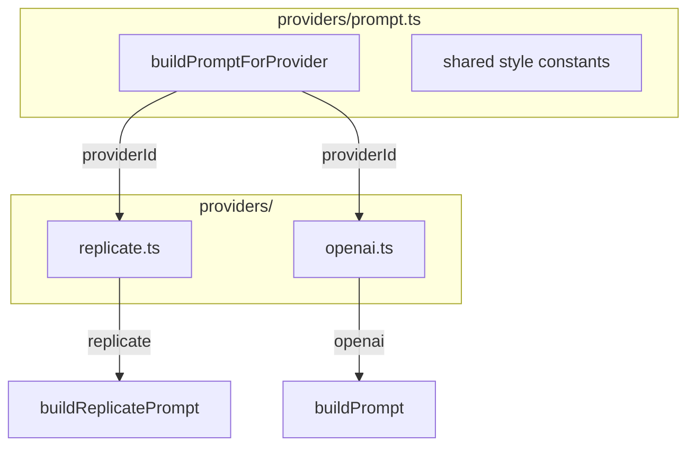

# План улучшения промптов для Replicate

> Референс для реализации. Все комментарии в коде — на английском.

## Чек-лист реализации

- [x] **prompt.ts**: REPLICATE_STYLE_SUFFIX, REPLICATE_NEGATIVE_PROMPT, buildReplicatePrompt, buildPromptForProvider, fallback
- [x] **replicate.ts**: buildPromptForProvider, negative_prompt, output_format png, contentType из ответа
- [x] **openai.ts**: buildPromptForProvider(input, "openai") в runGenerate
- [x] **Vitest + prompt.test.ts**: тесты buildReplicatePrompt, buildPromptForProvider
- [x] **Vitest + replicate.test.ts**: primary success, 400 fallback success, output url/contentType handling
- [x] **Rollout env**: REPLICATE_PROMPT_VERSION=v1|v2
- [x] **Soft fallback**: при 400 повтор без optional параметров
- [x] **Telemetry**: prompt_version, attempt, status, latency_ms, content_type (без prompt/PII)
- [x] **REPLICATE_SETUP.md**: секция про промпты, output_format, negative_prompt

---

## 1. Текущее состояние

**Поток данных:**

```
process-job.ts → generateImageForBeat(beat, photoUrls, jobId)
    → generateIllustration({ beat, photoUrls, jobId })  // styleHints не передаётся
        → provider.generate(input)
            → buildPrompt(input)  // один промпт для всех провайдеров
```

**Текущий промпт** (`src/lib/ai/providers/prompt.ts`):

```
[illustration_instructions]. children's storybook illustration, warm, age-appropriate, storybook style. [styleHints]
```

**Проблемы:**

- Слишком общий для SDXL/InstantID — модель лучше реагирует на конкретные стилевые токены
- Нет negative_prompt — не отсекаются нежелательные артефакты
- Один промпт для всех провайдеров — OpenAI и Replicate имеют разные требования
- `styleHints` не используется (orchestrator не передаёт)

---

## 2. Целевая архитектура (расширяемость)



**Принципы:**

- Каждый провайдер получает промпт через единую точку входа `buildPromptForProvider(input, providerId)`
- Общие константы (стиль, негативы) — в одном месте, переиспользуются
- Добавление нового провайдера (PhotoMaker, RunPod) — новый case в switch + своя функция сборки
- `ImageGenerationInput` остаётся неизменным; `styleHints` зарезервирован для будущего (user preferences, A/B тестов)

---

## 3. Изменения по файлам

### 3.1 `src/lib/ai/providers/prompt.ts`

**Структура модуля:**

| Экспорт | Назначение |
|---------|------------|
| `buildPromptForProvider(input, providerId)` | Единая точка входа, роутинг по провайдеру |
| `buildPrompt(input)` | Дефолт / OpenAI generate (backward compat) |
| `buildEditPrompt(input)` | OpenAI images.edit (без изменений логики) |
| `buildReplicatePrompt(input)` | Новый: расширенный промпт для SDXL/InstantID |
| `REPLICATE_NEGATIVE_PROMPT` | Константа негативного промпта |

**buildReplicatePrompt — структура:**

```
[scene: illustration_instructions]
[style: painterly, soft artistic, children's book art, warm muted earth tones, soft diffused lighting, highly detailed, sharp focus on subject, soft background, professional quality, age-appropriate, cozy warm ambiance]
[styleHints: если есть]
```

Формат: comma-separated токены (SDXL лучше воспринимает).

**Fallback:** если `illustration_instructions` пустой — вернуть `"child in storybook illustration style, " + REPLICATE_STYLE_SUFFIX`.

**REPLICATE_NEGATIVE_PROMPT:**

```
ugly, deformed, blurry, low quality, oversaturated, harsh lighting, photorealistic, dark, scary, violent
```

**Комментарии (English):**

- `/** Shared style constants for illustration prompts. Reused across providers. */`
- `/** Builds prompt for Replicate InstantID. SDXL responds better to comma-separated style tokens. */`

### 3.2 `src/lib/ai/providers/replicate.ts`

**Изменения:**

1. Импорт: `buildPromptForProvider`, `REPLICATE_NEGATIVE_PROMPT` вместо `buildPrompt`
2. Вызов: `prompt: buildPromptForProvider(input, "replicate")` — единая точка входа
3. В `input` добавить: `negative_prompt: REPLICATE_NEGATIVE_PROMPT`
4. **output_format**: передать `output_format: "png"` — Replicate по умолчанию возвращает webp; без этого contentType не совпадает с фактическим форматом
5. **Content-Type**: определять из `res.headers.get("Content-Type")` при fetch результата; fallback на `"image/png"` если заголовок отсутствует
6. Опционально: `ip_adapter_scale: 0.8`, `num_inference_steps: 35` — константы или env

**Проверка API:** zsxkib/instant-id поддерживает `negative_prompt`, `output_format` (png/webp).

**Soft fallback (обязательно):**

- Первый вызов: полный input (`image`, `prompt`, `negative_prompt`, `output_format`)
- Если провайдер возвращает 400/validation error: второй вызов с минимальным input (`image`, `prompt`)
- Если fallback тоже падает: проброс ошибки выше (текущий placeholder fallback в image-generator остаётся)
- В логах помечать `attempt=primary|fallback`

### 3.3 `src/lib/ai/providers/openai.ts`

Переключить на `buildPromptForProvider(input, "openai")` для единообразия. Внутри роутера — вызов `buildPrompt` (логика без изменений). `buildEditPrompt` остаётся для runEdit.

### 3.4 `src/lib/ai/orchestrator.ts`

**Опционально (для будущего):** передача `styleHints` в `generateImageForBeat`. Сейчас не требуется — план не включает, но архитектура это допускает.

### 3.5 `Rollout / versioning`

- Ввести env: `REPLICATE_PROMPT_VERSION` со значениями `v1` и `v2`
- `v1`: консервативный prompt (совместимый baseline)
- `v2`: новый prompt builder + negative_prompt + output_format
- Default: `v2` в staging, затем постепенное включение в production
- В логах обязательно фиксировать `prompt_version`

---

## 4. Взаимодействие с будущими компонентами

| Компонент | Связь с промптами |
|-----------|-------------------|
| **Blueprint / templates** | `illustration_instructions` — источник сцены. Формат не меняется. |
| **User preferences** | Будущее: `styleHints` из профиля (theme, color palette) → передаётся в `generateIllustration` |
| **A/B testing** | `buildPromptForProvider` может принимать `variant?: string` для разных стилей |
| **Новый провайдер (PhotoMaker, RunPod)** | Добавить `case "photomaker": return buildPhotoMakerPrompt(input)` в `buildPromptForProvider` |
| **Plan 06 (Image Pipeline)** | Промпт-модуль — часть провайдера; 06 не меняется |

---

## 5. Константы и конфигурация

**Вынести в константы (в prompt.ts или отдельный `prompt-constants.ts`):**

```ts
/** Style tokens for Replicate/SDXL. Comma-separated for better model adherence. */
const REPLICATE_STYLE_SUFFIX = [
  "painterly digital illustration",
  "soft artistic style",
  "children's storybook art",
  "warm muted earth tones",
  "soft diffused natural lighting",
  "highly detailed",
  "sharp focus on subject",
  "soft background depth of field",
  "professional quality",
  "age-appropriate",
  "cozy warm ambiance",
].join(", ");
```

**Env (опционально, для экспериментов):**

- `REPLICATE_NEGATIVE_PROMPT_OVERRIDE` — переопределение негативного промпта
- `REPLICATE_IP_ADAPTER_SCALE` — если нужна тонкая настройка

---

## 6. Unit-тесты

**Зависимости:** В проекте нет тестового фреймворка. Добавить Vitest: `npm install -D vitest` в `app/`, добавить `"test": "vitest run"` в scripts.

**Файл:** `src/lib/ai/providers/__tests__/prompt.test.ts`

**Тесты для buildReplicatePrompt:**

- С валидным input — промпт содержит scene + style suffix
- С пустым `illustration_instructions` — fallback "child in storybook illustration style" + style
- С `styleHints` — styleHints добавлены в конец
- Формат: comma-separated, без лишних точек

**Тесты для buildPromptForProvider:**

- `"replicate"` — вызывает buildReplicatePrompt
- `"openai"` — возвращает результат buildPrompt

**Тесты для replicate.ts (mock Replicate + fetch):**

- Успешный primary вызов: используется полный input с `negative_prompt` и `output_format`
- 400 на primary: выполняется fallback с урезанным input
- Fallback success: возвращается buffer + contentType из headers
- Невалидный output URL: выбрасывается ошибка
- Нет `Content-Type` в fetch-ответе: fallback на `image/png`

---

## 7. Порядок реализации

1. **prompt.ts**: добавить `REPLICATE_STYLE_SUFFIX`, `REPLICATE_NEGATIVE_PROMPT`, `buildReplicatePrompt`, `buildPromptForProvider`. Сохранить `buildPrompt` и `buildEditPrompt` для OpenAI.
2. **Rollout config**: добавить `REPLICATE_PROMPT_VERSION` (v1/v2) и routing по версии.
3. **replicate.ts**: использовать `buildPromptForProvider(input, "replicate")`, добавить `negative_prompt`, `output_format: "png"`, корректный contentType и soft fallback при 400.
4. **openai.ts**: переключить на `buildPromptForProvider(input, "openai")` (внутри — buildPrompt).
5. **Tests**: добавить Vitest, unit-тесты prompt + mock-тесты replicate provider.
6. **Telemetry**: добавить структурированные логи (`prompt_version`, `attempt`, `status`, `latency_ms`, `content_type`) без prompt/PII.
7. **Ручная проверка + DoD**: прогнать фиксированный набор кейсов и зафиксировать базовые метрики качества/латентности/fallback-rate.
8. **Документация**: обновить `REPLICATE_SETUP.md` (prompts, versioning, fallback, output_format, negative_prompt).

---

## 8. Риски и митигация

| Риск | Митигация |
|------|-----------|
| Промпт слишком длинный | SDXL поддерживает ~77 токенов эффективно; при необходимости сократить REPLICATE_STYLE_SUFFIX |
| Негативный промпт конфликтует | `REPLICATE_NEGATIVE_PROMPT_OVERRIDE` для быстрого отключения/изменения |
| Регрессия OpenAI | OpenAI не трогаем; `buildPrompt`/`buildEditPrompt` без изменений |
| Падение из-за несовместимых параметров Replicate | Soft fallback: ретрай с минимальным input без optional полей |
| Сложно откатить prompt-изменения | `REPLICATE_PROMPT_VERSION` + поэтапный rollout |
| Нет объективной оценки улучшения | Ввести DoD-метрики: quality score, latency, fallback-rate |

---

## 9. Файлы для изменения

| Файл | Действие |
|------|----------|
| `app/src/lib/ai/providers/prompt.ts` | Расширить: buildReplicatePrompt, buildPromptForProvider, константы, fallback |
| `app/src/lib/ai/providers/replicate.ts` | buildPromptForProvider, negative_prompt, output_format: "png", contentType из ответа |
| `app/src/lib/ai/providers/openai.ts` | buildPromptForProvider(input, "openai") в runGenerate |
| `app/src/lib/ai/providers/__tests__/prompt.test.ts` (новый) | Unit-тесты buildReplicatePrompt, buildPromptForProvider |
| `app/src/lib/ai/providers/__tests__/replicate.test.ts` (новый) | Mock-тесты primary/fallback/contentType/output-url |
| `app/package.json` | Добавить vitest, script "test" |
| `app/docs/REPLICATE_SETUP.md` | Секция про промпты, output_format, negative_prompt |

---

## 10. Definition of Done (минимум)

- Реализован `REPLICATE_PROMPT_VERSION` с поддержкой `v1|v2`
- Реализован soft fallback при 400 от Replicate
- Все unit + mock provider тесты проходят (`npm test`)
- Логи содержат `prompt_version` и `attempt` без утечки prompt/PII
- На тестовом наборе из 10+ сцен качество не хуже baseline, fallback-rate контролируемый
